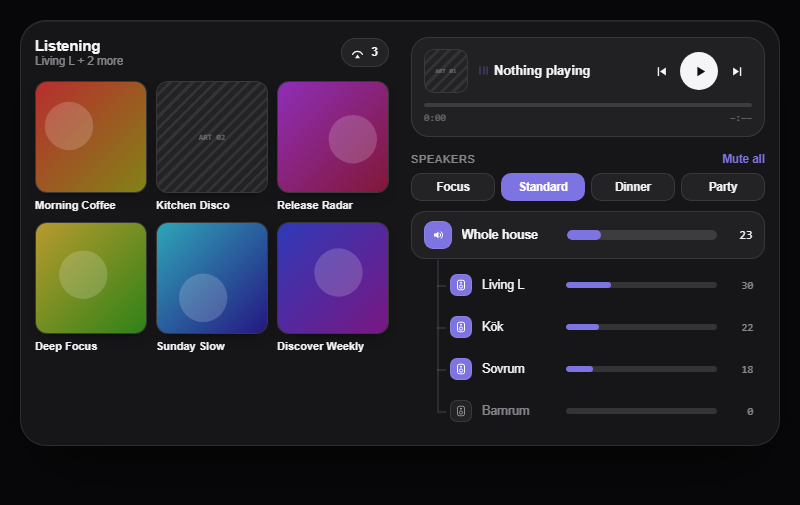

# Multiroom Spotify Card for Home Assistant

A dashboard card for starting Spotify playlists on a multi-room Chromecast
speaker group, with a volume slider per room, a master volume, and mood
presets. One tap on a playlist, and the music plays in sync in every room you
have switched on.



The card starts the music through [Spotcast](https://github.com/Mincka/spotcast)
(recommended) or [SpotifyPlus](https://github.com/thlucas1/homeassistantcomponent_spotifyplus).
Both launch Spotify's own Cast receiver on the speaker group, so what plays is a
real Spotify Connect session that the Spotify app can take over afterwards.

## Features

- **Playlists**: recently played or most played, as tiles or a compact list, built from what the house actually plays (from every app, not only this card) and topped up with your own playlists.
- **Speakers**: one row per room with its own volume slider and on/off toggle, a master row that scales every room proportionally, and a speaker picker sheet.
- **Presets**: "Focus", "Dinner", "Party"… each sets the volume of the rooms it wants and mutes the rest. The active preset is derived from the live speaker state, so the card never claims a mood that isn't true. An optional default preset is applied when music starts from a cold group.
- **Now playing**: artwork, track, artist, playlist, transport and seek, read from the Cast group entity, which costs no Spotify API calls.
- **Layout**: one column on a phone, two columns (playlists left, player and speakers right) on a tablet in landscape or on a desktop, automatically.
- Dark and light appearance following the Home Assistant theme; visual editor for the main options.

## How multi-room works

Chromecast has no API for dynamic grouping, so synchronized playback uses a
**speaker group created in the Google Home app**. The card always plays to that
group. Speaker rows and presets only mute/unmute and set the volume of each
speaker's own Google Cast entity, so "off" means "muted in the group". Add or
remove rooms in Google Home; the card follows.

## Prerequisites

Always:

- **Home Assistant** 2024.x or newer (developed on 2026.x).
- **Spotify Premium**. Spotify Connect and playlist playback on Cast devices need it.
- A **Chromecast speaker group** created in the Google Home app, containing the speakers you want to control. Multi-room sync is done by the group, so the card always plays to it.
- The **Google Cast** integration in Home Assistant, with one `media_player` entity per speaker and one for the group. The speaker entities drive the volume rows and presets; the group entity feeds the now-playing bar.

For `multiroom-spotify-card` with **Spotcast** (recommended: fastest start, no token script, one integration):

- **[Spotcast](https://github.com/Mincka/spotcast) v6.6 or newer** (the maintained fork), added to HACS as a custom repository of type Integration, and set up with your own Spotify developer app (client id and secret). The setup flow includes a "desktop authorization" step that logs Spotcast in as the Spotify desktop app; that is what lets it wake an idle Chromecast. No Python script needed.
- **Immediately after adding the integration, before the first start**, open Spotcast's options and set the **base refresh rate to 3600** seconds. The default of 30 seconds polls Spotify every 15 seconds; on a developer account created after February 2026 that trips short `429` limits within minutes, and a client that resumes right after each one is escalated by Spotify to a block of about a day. The card does not use Spotcast's own sensors, so hourly polling loses nothing.
- Set `backend: spotcast` in the card.

For `multiroom-spotify-card` with **SpotifyPlus** (alternative: richer play history straight from Spotify):

- **[SpotifyPlus](https://github.com/thlucas1/homeassistantcomponent_spotifyplus) v1.0.220 or newer** (v1.0.86 works but needs the workarounds under "Known issue" below), installed through HACS and set up with your own Spotify developer app (client id and secret).
- The **Spotify Desktop Player token** configured in SpotifyPlus, following
  [Google Chromecast Device Support](https://github.com/thlucas1/homeassistantcomponent_spotifyplus/wiki/Device-Configuration-Options#google-chromecast-device-support)
  in the SpotifyPlus wiki. Without it SpotifyPlus cannot wake an idle Chromecast. Notes and a helper for creating the token on Windows are in [`tools/spotifyplus-auth`](tools/spotifyplus-auth/README.md).
- The group must be discoverable over mDNS from the Home Assistant host (same network, or an mDNS reflector across VLANs). Check with `media_player.spotifyplus` → `source_list`: the group's name should be listed.
- Optional but recommended: the [start script](docs/start-script.yaml) and the [automations](docs/automations.yaml) described under the known issue below.

## Installation

### HACS (recommended)

1. HACS → three-dot menu → **Custom repositories** → add `https://github.com/bergh2/multiroom-spotify-card` with type **Dashboard**.
2. Search for **Multiroom Spotify Card** and install it. HACS registers the resource `/hacsfiles/multiroom-spotify-card/multiroom-spotify-card.js`.
3. Reload the browser, then add a card (search for "Multiroom Spotify Card").

### Manual

Copy `dist/multiroom-spotify-card.js` to `config/www/multiroom-spotify-card/` and add
`/local/multiroom-spotify-card/multiroom-spotify-card.js` as a **JavaScript module**
resource under Settings → Dashboards → Resources.

## Configuration: `multiroom-spotify-card`

```yaml
type: custom:multiroom-spotify-card
backend: spotcast                              # spotcast (recommended) or spotifyplus (default)
cast_group_entity: media_player.all            # Google Cast entity of the speaker group
# SpotifyPlus backend only:
# spotifyplus_entity: media_player.spotifyplus # SpotifyPlus player
# device_name: All                             # the group's name as Spotify Connect sees it
speakers:                                      # Google Cast entities, in display order
  - entity: media_player.living_room
    name: Living room
  - entity: media_player.kitchen
    name: Kitchen
  - entity: media_player.bedroom
    name: Bedroom
presets:                                       # speakers not listed in a preset are muted by it
  - name: Focus
    levels: { media_player.living_room: 35 }
  - name: Standard
    levels: { media_player.living_room: 30, media_player.kitchen: 22, media_player.bedroom: 18 }
  - name: Party
    levels: { media_player.living_room: 78, media_player.kitchen: 68 }
default_preset: Standard
master_label: Whole house
layout: auto
playlist_count: 8
tile_columns: 3
tile_columns_wide: 4
```

How it works:

- **Start (Spotcast)**: `spotcast.play_media` on the Cast group entity. Spotcast uses the Cast connection Home Assistant already holds for the group, so it always reaches the group's current leader, launches the Spotify app, logs the group in and transfers playback. A cold start typically takes 10 to 20 seconds on a six-speaker group.
- **Start (SpotifyPlus)**: `spotifyplus.player_media_play_context` on `device_name`. The now-playing bar shows "Starting on …" with a spinner until the Cast group reports the Spotify app playing. Waking a group from cold takes 20 to 35 seconds; resuming a paused group is instant. If the start fails because SpotifyPlus holds a stale address for the group (fixed in SpotifyPlus 1.0.220), the card reloads the SpotifyPlus integration and retries once (requires an admin user).
- **Now playing and transport** come from the Cast group entity by default (`control_via: cast`), which needs no Spotify API calls and stays in sync with the Spotify app. `control_via: spotifyplus` uses the SpotifyPlus entity instead.
- **Playlists**: a play history stored in Home Assistant user data under `history_key` feeds both orders, so "most played" keeps improving over time. With Spotcast the history is built from the playlists you start in the card plus whatever Spotify reports playing while the group plays (from any app or device); names and artwork of playlists you do not follow come from Spotify's public oEmbed endpoint, which costs no API quota. With SpotifyPlus it is fed from Spotify's "recently played" tracks (the last 50). With `fill_with_favorites` (default on) the remaining slots show your own playlists until real plays take their place. Playlists you delete in Spotify disappear from the history within a day.
- **Spotify API quota**: since July 2026 Spotify counts a daily quota per developer account, shared by all your development-mode apps, with a small budget for playlist endpoints. The card therefore fetches your playlist library at most every 12 hours and caches it in user data shared by every dashboard instance, asks for the playback context only while the group is playing, and keeps showing the cached history when a quota is exhausted (Spotify answers `429 QUOTA_EXCEEDED` until the next day). Keep other integrations from polling Spotify aggressively: 3600 s in Spotcast, 60 s in SpotifyPlus, and disable Home Assistant's built-in Spotify integration, which polls every 30 s.
- **Server-side start (recommended)**: set `start_script` to a Home Assistant script that receives `context_uri`, `device_name`, `group_entity` and `shuffle`, starts the context via SpotifyPlus, waits for the Cast group to report Spotify playing, and reloads SpotifyPlus and retries once if it does not. The card then only fires the script and shows "Starting on …" for as long as the script entity is running, so the recovery keeps going even when a phone suspends the dashboard, and the card never gives up before the script does. A ready-made script is in [`docs/start-script.yaml`](docs/start-script.yaml); without `start_script` the card does the same retry from the browser. Note that SpotifyPlus itself retries once internally, so a start that needs the reload takes two to three minutes; a normal start takes 10 to 30 seconds.
- **API use**: refresh on load, a minute after a start, and every 10 minutes while the card is visible. Roughly 10 to 30 Spotify API calls per day. Spotify's developer quota is shared per developer account, so keep other integrations using the same account from polling aggressively.

## Options

| Option | Default | Description |
|---|---|---|
| `speakers` | required | Google Cast entities, as strings or `{entity, name}`. Order is the display order. |
| `presets` | `[]` | List of `{name, levels}`. `levels` maps entity → volume 0–100; omitted speakers are muted. Edited in YAML. |
| `default_preset` | none | Preset applied automatically when a playlist is started while the group is cold (not playing or paused) and no speaker has been touched since it went idle. Pause/resume and preset taps are never overridden. |
| `master_volume` | `true` | Master row above the speakers: the average of the unmuted speakers; dragging scales each of them proportionally. |
| `master_label` | `All` | Name of the master row. |
| `master_style` | `panel` | `panel`: an inset block with the speakers on a rail under it. `plain`: a row like the speakers. `tree`: no panel, speakers indented on a rail. |
| `layout` | `vertical` | `vertical`: one column. `horizontal`: playlists left, player and speakers right. `auto`: horizontal when the card is at least 600 px wide. Give the card the full section width for the two-column layouts (in a sections view, `column_span: 2` on the section). |
| `playlist_layout` | `tiles` | `tiles` or `list`. |
| `playlist_sort` | `last_played` | `last_played` or `play_count`. |
| `playlist_count` | 6 / 10 | Playlists shown (tiles / list). |
| `tile_columns`, `tile_columns_wide` | 3 / same | Playlists per row (2–8) in the one-column and two-column layouts. |
| `speaker_count` | all | Speaker rows shown in the card; the picker always lists all. |
| `preset_tolerance` | 3 | Allowed volume difference when matching the active preset. |
| `title`, `accent` | `Listening`, indigo | Header text and accent colour (any CSS colour). |
| `backend` | `spotifyplus` | `spotcast` or `spotifyplus`: the integration that starts playback and lists your playlists. |
| `spotcast_account` | default account | Spotcast config entry id, only when several Spotify accounts are set up in Spotcast. |
| `cast_group_entity`, `spotifyplus_entity`, `device_name`, `control_via`, `shuffle`, `fill_with_favorites`, `history_key`, `start_script` | see above | |

## Known issue: the Cast group changes leader

A Google Cast speaker group has no address of its own. One member is elected
leader and hosts the group, and the leader changes whenever a member reboots,
drops off Wi-Fi, or the group re-forms (nightly maintenance on the router or
the speakers is a common trigger). Every Cast client handles this by
re-discovering the group over mDNS; Home Assistant's own Cast integration does.
SpotifyPlus caches the leader's address and keeps using it, so the next start
after a leader change fails with

```
Failed to connect to service HostServiceInfo(host='192.168.x.y', port=32127, ...)
Could not activate Spotify Cast application ... wait timed out after 20 s
```

until the SpotifyPlus integration is reloaded. This was
[SpotifyPlus issue #248](https://github.com/thlucas1/homeassistantcomponent_spotifyplus/issues/248)
and is **fixed in SpotifyPlus v1.0.220** (library `spotifywebapipython` 1.0.294):
the integration now asks the group members who the leader is and verifies the
connection before every start. Update SpotifyPlus to 1.0.220 or newer and none
of the workarounds below are needed. They remain documented for older versions,
and `start_script` is still useful on its own because it keeps the start
running server-side:

1. **`start_script`** (see above): the start runs inside Home Assistant, verifies
   that the group actually started, and reloads SpotifyPlus and retries once if
   it did not. Without the option the card does the same from the browser, which
   only works while the dashboard stays open.
2. **Reload after restarts**: an automation that reloads SpotifyPlus a few
   minutes after each Home Assistant start and once every morning, so the first
   start of the day does not pay the retry.
3. **Reload after the group re-forms**: an automation that reloads SpotifyPlus
   two minutes after the group's Cast entity comes back from `unavailable`,
   unless music is playing on it. Short leader flickers do not always make the
   entity unavailable, so this catches most but not all changes; the script
   above covers the rest.

Both automations are in [`docs/automations.yaml`](docs/automations.yaml);
replace the config entry id and the group entity. Reloading SpotifyPlus costs a
handful of Spotify API calls and takes about ten seconds, during which its
entity is unavailable.

If the leader changes many times a day, look at the speakers' Wi-Fi as well:
scheduled channel optimization, band steering, minimum RSSI and multicast
filtering on the WLAN all make Cast devices drop and rejoin, and every rejoin
can trigger an election. `tools/spotifyplus-auth/group_watch.py` logs each
change with a timestamp so you can match it against the router's client history.

## Troubleshooting

- **"Starting on …" ends with "did not start"**: SpotifyPlus could not wake the group. Check that the Desktop Player token is installed, and that the group name in `device_name` matches the Spotify Connect device list (`media_player.spotifyplus` → `source_list`). If the Home Assistant log says `Failed to connect to service HostServiceInfo(...)`, the group has moved to another speaker and SpotifyPlus has a stale address; see the known issue above. `tools/spotifyplus-auth/mdns_cast.py` shows where the group really is.
- **A speaker shows `n/a` while the group plays**: it is not a member of the Google Home group. Add it in the Google Home app.
- **Speakers show `–` when idle**: Google Cast strips volume and mute attributes while a speaker is off. Values you set before pressing play are remembered and applied.
- **Only a few playlists after a fresh install**: Spotify reports the last 50 tracks only. The history grows with use; `fill_with_favorites` fills the gaps meanwhile.
- **Everything stops when bedtime music starts in one room**: Spotify allows one stream per account. Starting a Connect session on one speaker moves the session there.

## Development

```bash
npm install
npm run dev        # mock preview: /dev/index.html (MA) and /dev/spotifyplus.html (SpotifyPlus)
npm test           # unit tests (vitest)
npm run build      # dist/multiroom-spotify-card.js
npm run deploy     # build + copy to HA_WWW_ROOT/multiroom-spotify-card/ (set HA_WWW_ROOT in .env.local)
```

`src/shared/` holds everything backend-independent (styles, speaker logic, the
`SpeakerCardBase` element); `src/spotcast/` and `src/spotifyplus/` the
backend-specific parts; `src/multiroom-spotify-card.ts` is the bundle entry. The
original design mockup and spec live in `docs/design/`. Versions up to 1.2 also
shipped a Music Assistant card (`custom:multiroom-spotify-card-ma`); it was
dropped in 2.0, and the last release that contains it is
[v1.2.0](https://github.com/bergh2/multiroom-spotify-card/releases/tag/v1.2.0).

## Acknowledgements

This card is only a front end. The heavy lifting is done by two projects
that deserve the credit:

- [Spotcast](https://github.com/Mincka/spotcast), the maintained fork of
  fondberg's original, which starts Spotify playback on idle Chromecasts through
  Home Assistant's own Cast connection.
- [SpotifyPlus](https://github.com/thlucas1/homeassistantcomponent_spotifyplus) by
  [thlucas1](https://github.com/thlucas1), which talks to the Spotify Web API and
  wakes Chromecast devices as Spotify Connect targets, and whose author fixed the
  Cast group leader issue within a week of the report.

The visual design was inspired by the classic
[spotify-card](https://github.com/custom-cards/spotify-card) and its maintained
fork [spotify-card-v2](https://github.com/mikevanes/spotify-card-v2), which showed
how good a playlist grid can look on a dashboard. No code was taken from either.

## Disclaimer

This project is not affiliated with, endorsed by, or sponsored by Spotify AB,
Google, Harman, or the authors of Spotcast and SpotifyPlus. Spotify is a
trademark of Spotify AB; Chromecast, Google Home and Nest are trademarks of Google
LLC. The card uses your own Spotify account through the integrations above and
need a Spotify Premium subscription. Use at your own risk; see the license.

## License

[MIT](LICENSE)
